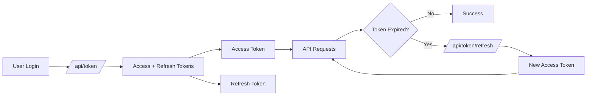

# Django REST Framework API with JWT Authentication

A complete guide to building a RESTful API with Django REST Framework (DRF) including JWT authentication, CRUD operations, and browsable API interface.

---

## 📋 Table of Contents

- [Prerequisites](#prerequisites)
- [Installation & Setup](#installation--setup)
- [Creating Models](#creating-models)
- [Serializers](#serializers)
- [Views](#views)
- [URL Configuration](#url-configuration)
- [Testing the API](#testing-the-api)
- [JWT Authentication](#jwt-authentication)
- [API Endpoints](#api-endpoints)
- [Testing with PowerShell](#testing-with-powershell)
- [Admin Interface](#admin-interface)

---

## 🚀 Prerequisites

Before you begin, ensure you have the following installed:

- **Python 3.8** or higher
- **pip** (Python's package manager)

Verify your installations:
```bash
python --version
pip --version
```

---

## 📦 Installation & Setup

### Step 1: Install Required Packages

```bash
pip install django djangorestframework djangorestframework-simplejwt
```

Verify Django installation:
```bash
django-admin --version
```

### Step 2: Create a New Django Project

```bash
django-admin startproject myapi
cd myapi
```

### Step 3: Create a Django App

```bash
python manage.py startapp api
```

### Step 4: Update `settings.py`

Open `myapi/settings.py` and update the `INSTALLED_APPS`:

```python
INSTALLED_APPS = [
    'django.contrib.admin',
    'django.contrib.auth',
    'django.contrib.contenttypes',
    'django.contrib.sessions',
    'django.contrib.messages',
    'django.contrib.staticfiles',
    'rest_framework',  # Add Django Rest Framework
    'api',  # Add your app
]

# REST Framework Configuration
REST_FRAMEWORK = {
    'DEFAULT_AUTHENTICATION_CLASSES': (
        'rest_framework_simplejwt.authentication.JWTAuthentication',
    ),
    'DEFAULT_RENDERER_CLASSES': [
        'rest_framework.renderers.JSONRenderer',
        'rest_framework.renderers.BrowsableAPIRenderer',
    ],
}
```

---

## 📊 Creating Models

### Step 5: Define Models

In `api/models.py`:

```python
from django.db import models

class Item(models.Model):
    name = models.CharField(max_length=100)
    description = models.TextField()
    
    def __str__(self):
        return self.name
```

### Step 6: Run Migrations

```bash
# Create migration files
python manage.py makemigrations
python manage.py makemigrations api

# Apply migrations to database
python manage.py migrate
```

---

## 🔄 Serializers

### Step 7: Create Serializer

Create `api/serializers.py`:

```python
from rest_framework import serializers
from .models import Item

class ItemSerializer(serializers.ModelSerializer):
    class Meta:
        model = Item
        fields = ['id', 'name', 'description']
```

---

## 👁️ Views

### Step 8: Create Views

In `api/views.py`:

```python
from rest_framework.views import APIView
from rest_framework.response import Response
from rest_framework import status
from .models import Item
from .serializers import ItemSerializer

class ItemsView(APIView):
    """View for listing and creating items"""
    
    def get(self, request):
        items = Item.objects.all()
        serializer = ItemSerializer(items, many=True)
        return Response(serializer.data)

    def post(self, request):
        serializer = ItemSerializer(data=request.data)
        if serializer.is_valid():
            serializer.save()
            return Response(serializer.data, status=status.HTTP_201_CREATED)
        return Response(serializer.errors, status=status.HTTP_400_BAD_REQUEST)

class ItemDetailView(APIView):
    """View for retrieving, updating and deleting a specific item"""
    
    def get(self, request, id):
        try:
            item = Item.objects.get(id=id)
        except Item.DoesNotExist:
            return Response(
                {"error": "Item not found"}, 
                status=status.HTTP_404_NOT_FOUND
            )
        serializer = ItemSerializer(item)
        return Response(serializer.data)

    def put(self, request, id):
        try:
            item = Item.objects.get(id=id)
        except Item.DoesNotExist:
            return Response(
                {"error": "Item not found"}, 
                status=status.HTTP_404_NOT_FOUND
            )
        serializer = ItemSerializer(item, data=request.data)
        if serializer.is_valid():
            serializer.save()
            return Response(serializer.data)
        return Response(serializer.errors, status=status.HTTP_400_BAD_REQUEST)

    def delete(self, request, id):
        try:
            item = Item.objects.get(id=id)
        except Item.DoesNotExist:
            return Response(
                {"error": "Item not found"}, 
                status=status.HTTP_404_NOT_FOUND
            )
        item.delete()
        return Response(
            {"message": "Item deleted successfully"}, 
            status=status.HTTP_204_NO_CONTENT
        )
```

---

## 🌐 URL Configuration

### Step 9: Configure App URLs

Create `api/urls.py`:

```python
from django.urls import path
from .views import ItemsView, ItemDetailView

urlpatterns = [
    path('items/', ItemsView.as_view(), name='items'),
    path('items/<int:id>/', ItemDetailView.as_view(), name='item-detail'),
]
```

### Step 10: Update Main URLs

In `myapi/urls.py`:

```python
from django.contrib import admin
from django.urls import path, include
from rest_framework_simplejwt.views import (
    TokenObtainPairView,
    TokenRefreshView,
)

urlpatterns = [
    path('admin/', admin.site.urls),
    path('api/', include('api.urls')),
    
    # JWT Authentication endpoints
    path('api/token/', TokenObtainPairView.as_view(), name='token_obtain_pair'),
    path('api/token/refresh/', TokenRefreshView.as_view(), name='token_refresh'),
]
```

---

## 🔑 JWT Authentication

### Step 11: Create Superuser

```bash
python manage.py createsuperuser
```

Follow the prompts to create an admin user:
```
Username: admin
Email address: admin@example.com
Password: admin123
Password (again): admin123
Superuser created successfully.
```

### Step 12: Get JWT Tokens

**Obtain Access & Refresh Tokens:**

```powershell
$response = Invoke-RestMethod -Uri "http://127.0.0.1:8000/api/token/" `
-Method POST `
-Headers @{ "Content-Type" = "application/json" } `
-Body '{"username":"admin","password":"admin123"}'

$access = $response.access
$refresh = $response.refresh

# Display tokens
$response | Format-List *
```

**Refresh Token (when access token expires):**

```powershell
Invoke-RestMethod -Uri "http://127.0.0.1:8000/api/token/refresh/" `
-Method POST `
-Headers @{ "Content-Type" = "application/json" } `
-Body '{"refresh":"your_refresh_token_here"}'
```

---

## 📝 API Endpoints

### Available Endpoints

| Method | Endpoint | Description | Authentication |
|--------|----------|-------------|----------------|
| POST | `/api/token/` | Get JWT access & refresh tokens | Yes |
| POST | `/api/token/refresh/` | Refresh expired access token | Yes |
| GET | `/api/items/` | List all items | Yes |
| POST | `/api/items/` | Create new item | Yes |
| GET | `/api/items/{id}/` | Get item by ID | Yes |
| PUT | `/api/items/{id}/` | Update item by ID | Yes |
| DELETE | `/api/items/{id}/` | Delete item by ID | Yes |

---

## 🧪 Testing with PowerShell

### Create a New Item

```powershell
Invoke-RestMethod -Uri "http://127.0.0.1:8000/api/items/" `
-Method POST `
-Headers @{ "Content-Type" = "application/json" } `
-Body '{"name":"My item four","description":"This is test item 4"}'
```

### Get All Items

```powershell
Invoke-RestMethod http://127.0.0.1:8000/api/items/
```

### Get Specific Item by ID

```powershell
Invoke-RestMethod http://127.0.0.1:8000/api/items/1/
```

### Get Item with Authentication

```powershell
Invoke-RestMethod http://127.0.0.1:8000/api/items/1/ `
-Headers @{ "Authorization" = "Bearer $access" }
```

### Delete an Item

```powershell
Invoke-RestMethod -Uri "http://127.0.0.1:8000/api/items/2/" -Method DELETE
```

### Using cURL (Alternative)

```bash
# GET request
curl http://127.0.0.1:8000/api/items/1/

# POST request
curl -X POST http://127.0.0.1:8000/api/items/ \
  -H "Content-Type: application/json" \
  -d '{"name":"My item","description":"This is a test item"}'

# With JWT authentication
curl http://127.0.0.1:8000/api/items/1/ \
  -H "Authorization: Bearer YOUR_ACCESS_TOKEN"
```

---

## 🔐 Admin Interface

### Access Admin Panel

1. Run the development server:
```bash
python manage.py runserver
```

2. Visit: `http://127.0.0.1:8000/admin/`

3. Login with superuser credentials:
   - Username: `admin`
   - Password: `admin123`

### Browsable API UI

Visit `http://127.0.0.1:8000/api/items/` in your browser to access the interactive browsable API provided by DRF.

You can:
- View all items in a user-friendly interface
- Test POST requests using the web form
- Explore API responses in JSON or HTML format

---

## 🔄 Full Authentication Flow



**Process Flow:**
1. User sends username + password to `/api/token/`
2. System returns `access` + `refresh` tokens
3. Frontend stores both tokens
4. Access token used for API requests
5. When expired → use refresh token
6. Get new access token

---

## 🛠️ Troubleshooting

### Common Issues

**Issue: Module not found**
```bash
# Solution: Install all dependencies
pip install django djangorestframework djangorestframework-simplejwt
```

**Issue: Migration errors**
```bash
# Solution: Reset migrations
python manage.py migrate --fake api zero
python manage.py migrate api
```

**Issue: Authentication failed**
```bash
# Check user exists
python manage.py shell
>>> from django.contrib.auth.models import User
>>> User.objects.all()
```

---

## 📊 Summary

Your Django REST API is now fully functional with:

✅ CRUD operations for Item model  
✅ JWT authentication with access & refresh tokens  
✅ Browsable API interface  
✅ Admin panel for data management  
✅ Comprehensive testing with PowerShell & cURL  

---

## 🔗 Useful Links

- [Django Documentation](https://docs.djangoproject.com/)
- [Django REST Framework](https://www.django-rest-framework.org/)
- [JWT Authentication Documentation](https://django-rest-framework-simplejwt.readthedocs.io/)
- [PowerShell Documentation](https://docs.microsoft.com/en-us/powershell/)

---

 
